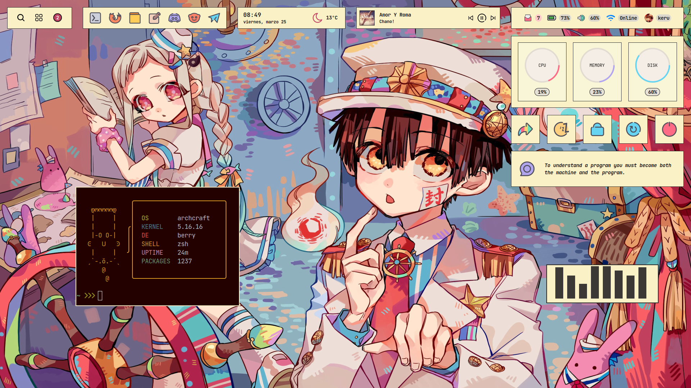

# Don't worry, be happy

<p align="center">
  
</p>

<p align="left">WM : <a href="https://berrywm.org/">Berry</a></p>
<p align="left">Bar : <a href="https://github.com/elkowar/eww">EWW</a>, Elkowar’s Wacky Widgets.</p>

### Installation

- Install Berry WM - [Instructions](https://berrywm.org/installation.html)
- Install Elkowar’s Wacky Widgets - [Instructions](https://elkowar.github.io/eww/)
- Clone this repository
```
$ git clone --depth=1 https://github.com/keru3p/dotfiles.git
```
- Copy everything from `config` directory to **`~/.config/`**
- Install the required fonts from **`fonts`** directory
- Put `eww` executable in your PATH (/bin, /usr/bin, etc).

### Tips

- Get you own [weather key](https://openweathermap.org/api) from `openweathermap`, It's free.
- Edit `mails` script and add your credentials to get unread mails.
- Change the profile image by replacing the file `profile.jpg` (**`~/.config/eww/images/profile.jpg`**)
- Music widget is for mpd/mpc, I don't use spotify, I don't care.
- Made for 1920x1080 displays only.

